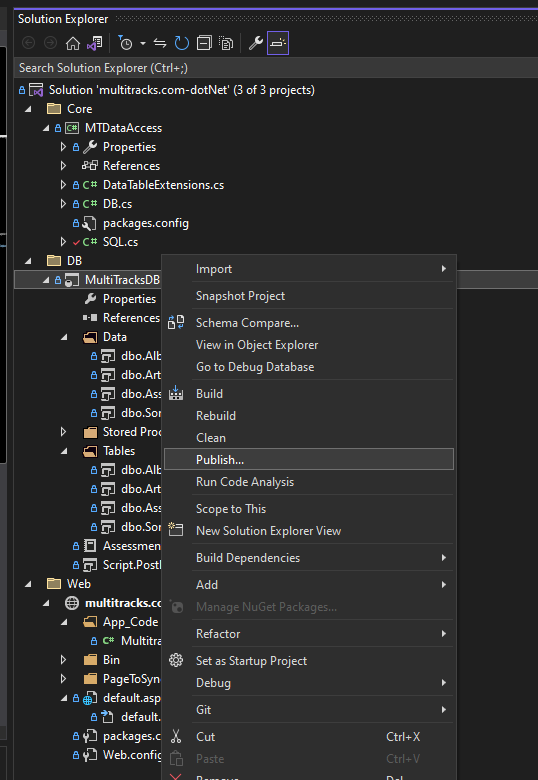
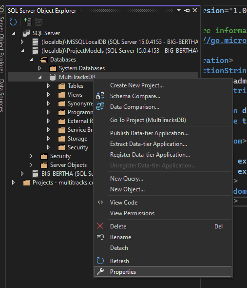

# Multitracks DotNetCore & DotNet5 Project

## Description
This project A take home test for a great potential job by Import into Visual Studio and install dependencies with .... command.  My motivation for this project was to to share a love of music in the worship space.
I wanted to solve the problem of this creates an API to showcase different artists, albums, and songs.  I learned How to successfully populate a connection string with Microsoft SQL Server.. 

# Table of Contents
- [Installation](#Installation)
- [Description](#Description)
- [Usage](#Usage)
- [What-I-learned](#What-I-Learned)
- [Tests](#Tests)
- [Screenshot-of-Application](#Screenshot-of-Application)
- [Links](#Links)
- [Questions?](#Questions?)

## Installation
In order to install this project you will need to REPLACE ME with "import into visual studio".

## Usage
This Project is used for A take home test for a great potential job. *elaborate on your project motivation and use here*

## What-I-Learned
This Project works by Import into Visual Studio and install dependencies with .... command. 
This was the steps of my learning process:
- I had to install SQL Server and create the database in the terminal using Transact-SQL commands
- Installed SQL server Management Studio (SSMS) to getter a better view of the database
- right clicked on "publish" in the folder directory here to get the database connection started
- right click "build" to populate the database MultitracksDB in the same submenu as above

- opened up "SQL Server Object Explorer" and right clicked on the correct database to find properties.

- After locating the connection string I had to delete parts of it
- It started out like this

  *insert code snippets here*

- and I deleted the 

- and had to modify it in the Web.config

##Tests
Test this code by With SQL server or SQL server management Studio

## Screenshot of Application

## Links
[Made with my homemade readme generator!](https://github.com/Byrdbass/MarkDown-MUHsheeen)

## Questions?
My gitHub user name is Byrdbass, and you may email me at byrdsjobhunt@gmail.com for Questions.
You may contribute to this project by loving god and find your way of worship through song.

